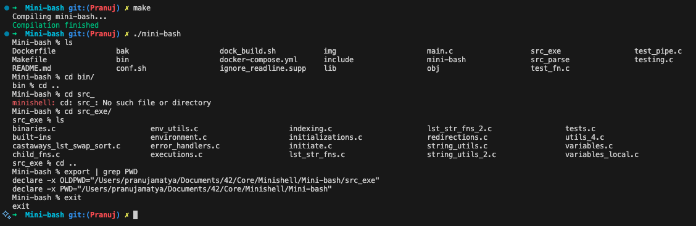

# Minishell

 

This project is a simple implementation of a Unix shell (bash) with basic command execution capabilities.

## Overview

Mini-bash is a lightweight Unix command line interpreter written in C as part of the 42 curriculum (project Minishell). It parses and executes commands similar to bash, providing a minimalist but functional shell experience.

## Features

- Command execution with arguments
- Environment variable expansion
- Export and unset environment and local variables
- Redirections (`<`, `>`, `>>`)
- Pipes (`|`)
- Signal handling (Ctrl+C, Ctrl+D, Ctrl+\)
- Built-in commands:
  - `echo` with -n option
  - `cd` with relative and absolute paths
  - `pwd`
  - `export`
  - `unset`
  - `env`
  - `exit`

## Screenshots

<div align="center">
  
  <p><em>Basic command execution and environment variables</em></p>
</div>

## Installation

```bash
# Clone the repository
git clone https://github.com/nuz8/Mini-bash.git

# Navigate to the project directory
cd Mini-bash

# Compile the program
make

# Run mini-bash
./mini-bash